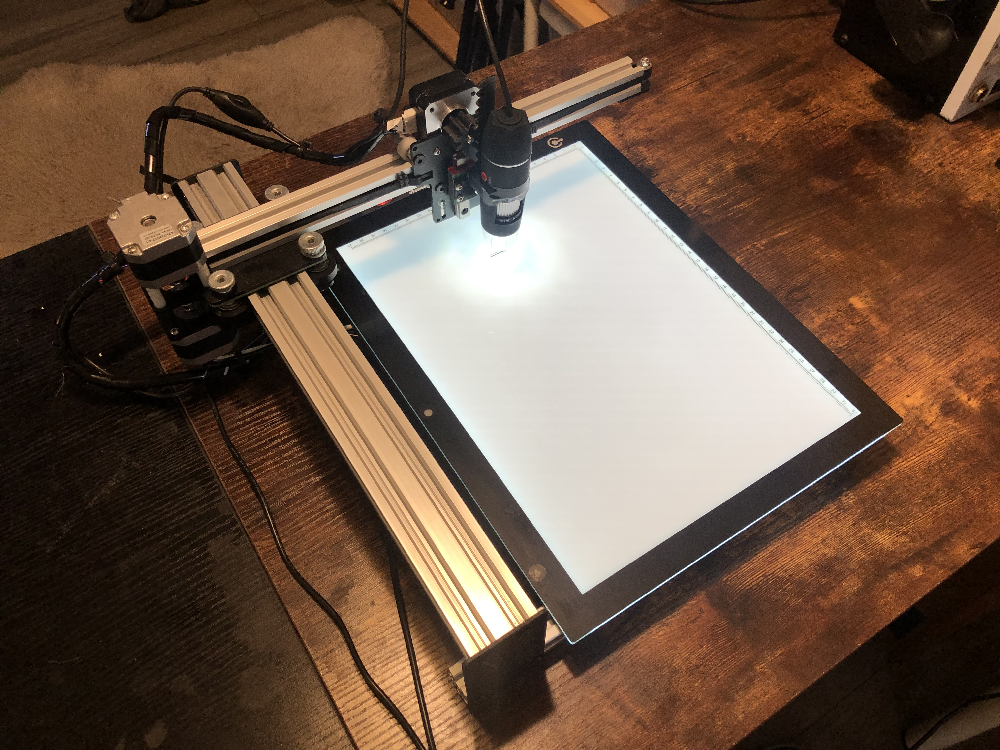
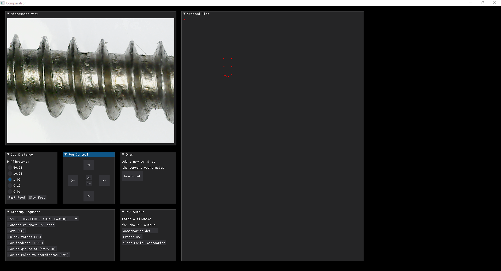

# comparatron
Comparatron - a DIY digital optical comparator

This is a DIY digital optical comparator, which is an instrument used to take precise measurements of physical objects through visual means. Optical comparators cost tens of thousands of dollars, but Comparatron costs less than $500 to build (most of that cost is the CNC pen plotter).

It is essentially a USB digital microscope mounted to a CNC pen plotter. The microscope provides a very clear view of the object, while the CNC pen plotter lets us move the microscope with high precision. Additionally, an LED-backlit tracing board removes shadows so that we see clean edges.

The software interface lets users connect to and control the movement of the CNC pen plotter and create points, then export those points as a DXF that they can import into CAD software. This makes Comparatron very useful for reverse-engineering, as you can find the exact dimensions of a part (down to around +/-0.02mm). That's especially true for organic and irregular geometry that is difficult to measure with calipers, and for objects that are very small.

-----------------------------------------------------------

Phyiscal build instructions are available at: (coming soon)

Parts needed for the build:

1. iDraw Pen Plotter 2.0 - A4 Size
2. Jiusion 40 to 1000x Magnification Endoscope
3. LitEnergy Portable A4 Tracing LED Copy Board Light Box
4. 3D-printed spur gear
5. 3D-printed microscope mount

Optional parts:

6. USB Hub
7. USB extension cable
8. 3M Commands strips (to attach light board and USB hub)
9. Zip ties (to tidy wiring)

-----------------------------------------------------------

Software notes:

The software is written in Python and uses the following modules: 
DearPyGUI
OpenCV
NumPy
PySerial
Serial Tools
EZDXF (full package)

I've only tested the software on Windows 10. It should work in other versions of Windows, but probably not on macOS or Linux (due to the way they handle COM ports). However, all of the modules are OS-agnostic, so it should be possible to tweak the Python code to work with other operating systems.

Both the Python script and a standalone Windows executable are available. The executable is ideal if you don't want to install the required dependencies yourself.

-----------------------------------------------------------

Software usage:

I hope the software is intuitive, but just in case I'll cover the basics here.

Upon launching the software, you'll get a window filled with several other windows.

The top-left window is the view from the microscope. The script uses the first available camera. If this doesn't work properly, make sure no other webcams are connected to your computer. The crosshair reticle in the middle of the video feed is a reference for placing your points.

The right window shows a visualization of the plotted points. It represents the ENTIRE tracing board, so if the measured object is small then it won't take up much space in that window. This is not interactive and you can't edit or move the points, it is just a visual representation of the log of drawn points.

The top-left window below the video feed provides movement settings, including distance and speed. I recommend using "Slow Feed" for your actual measurements and only using "Fast Feed" for getting close to the object when you first start. 

The next window to the right is the jog control. This lets you move the microscope. Z adjustments should really only be used to focus the object. The machine homes to the top-right of the tracing board, so all Y-axis measurements are negative and you need to push the "Y-" button to move down onto the tracing board.

The next window to the right is for drawing tools. At this time, the only tool available is "New Point." That creates a point at the global WPS coordinates, both in the DXF file and in the visual representation in the "Created Plot" window. Other tools, such as lines, may be added in the future. But points are the most important, as you will do your actual drawing in CAD using those points for reference.

The bottom-left window provides everything for connecting to and setting up the pen plotter on startup. I recommend activating each command in order (top to bottom). Start by selecting the COM port of the iDraw machine from the drop-down menu. It should say something like "USB-SERIAL CH340" and the COM port number. Then click "Connect to the above COM port" to connect to the machine through serial (the Python console provides printed responses). Next, Home the machine, Unlock the motors, Set the feedrate, Set the origin point, and finally Set the machine to relative coordinates.

The last window is the "DXF Output" tool. Simply specify the filename you'd like, then click "Export DXF." It will save a DXF file with your chosen name in the same folder as the Python script/executable. You can do this as many times as you like. If you use the same filename, it will overwrite the original file. Or you can use a new filename. In both cases, it will contain all of the drawn points since you first launched the software. When you're finished, I recommend pressing "Close Serial Connection" so that you can reconnect to the machine later without power cycling it.

-----------------------------------------------------------

Suggested workflow:

1. Plug in USB cables for tracing board, microscope, and pen plotter.
2. Plug in DC power adapter for pen plotter.
3. Turn on the tracing board and the pen plotter.
4. Launch Comparatron software.
5. Connect to COM port and follow startup sequence.
6. Move Z axis up to gain clearance.
7. Use Fast Feed to move close to your object.
8. Switch to Slow Feed to find an edge.
9. Adjust Z axis until the edge is in focus.
10. Follow the edges at Slow Feed and add points to trace your object
11. Export DXF
12. Open Autodesk Fusion 360 or other CAD software (or even PCB design software)
13. Import the DXF (as millimeters)
14. Use the points as needed for your design
